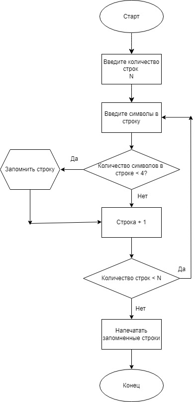

# Итоговая домашняя работа

## Код итоговой работы
Console.WriteLine("Введите количество строк в массиве:");
int count = int.Parse(Console.ReadLine());

    string[] array = new string[count];
    
    for (int i = 0; i < count; i++)
    {
        Console.WriteLine($"Введите строку {i + 1}:");
        array[i] = Console.ReadLine();
    }

    Console.WriteLine("Строки с длиной меньше 4 символов:");

    foreach (string str in array)
    {
        if (str.Length < 4)
        {
            Console.WriteLine(str);
        }
    }

## Описание кода
* 4 Запрашиваем у пользователя требуемое количество строк в массиве
* 5 В переменную count записываем введенное пользователем
количество строк.
* 8 Создаем строковый массив array с количеством строк count.
* 10 Создаем счетчик строк.
* 11-14 Создаем цикл заполнения строк с прибавлением +1 к итерации.
* 16-24 Создаем цикл вывода всех строк с количеством символов < 4.

## Блок схема кода 
